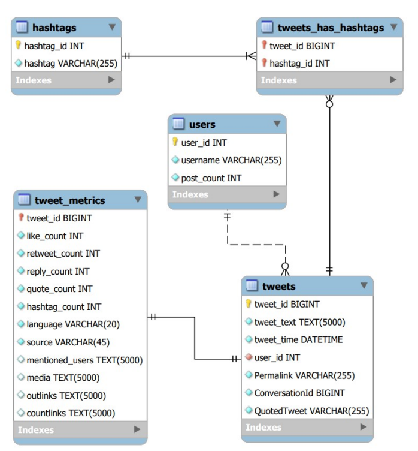
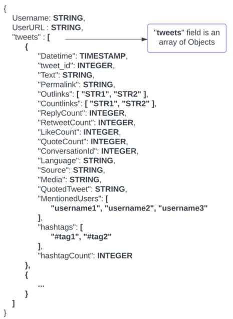

# ChatGPT-Tweets-Application

## MySQL Application

- This project is a database application constructed on Tweets containing **#ChatGPT** hashtag or keyword. 
- This [dataset](https://www.kaggle.com/datasets/tariqsays/chatgpt-twitter-dataset/) is collected from [Kaggle](https://www.kaggle.com/) and preprocessed, normalized and stored in a MySQL database locally. 
- Its connectivity is tested by hosting it on [AWS RDS](https://aws.amazon.com/rds/) (Relational Database Service).
- Meaningful insights were generated by querying the database using SQL queries.
- Several Triggers, Stored Procedures were implemented in the database.
- The performance of the database is measured using Memory usage, I/o Hotspots, InnoDB stats, Buffer pool and latency.

## MongoDB Application

- The same dataset is also modelled in [MongoDB](https://www.mongodb.com/) by designing a Document structure by preprocessing in Python.
- Database is hosted on MongoDB cluster on the cloud.
- Advanced features like MongoDB Charts in [Atlas](https://www.mongodb.com/atlas) are used to visualize insights from the database.
- Performance of MongoDB is measures in terms of latency, buffer and scalability.
- MongoDB shown to have lower latency than MySQL application. 

